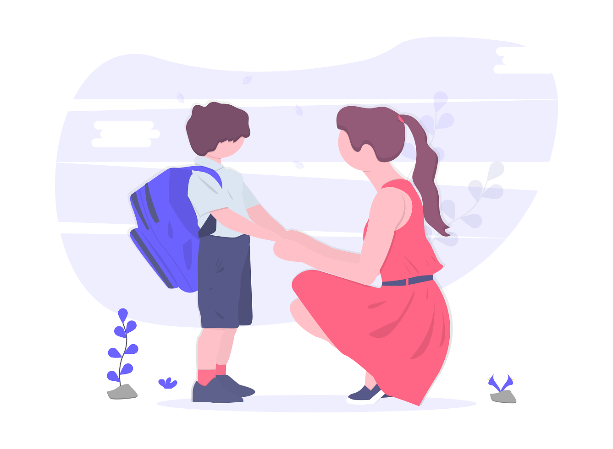
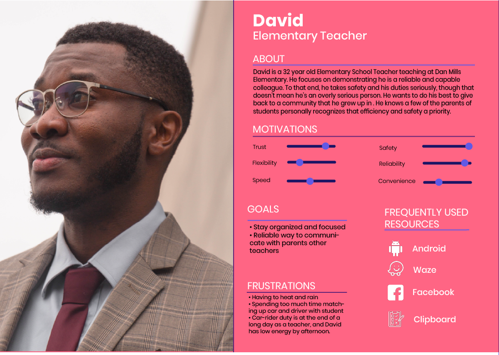
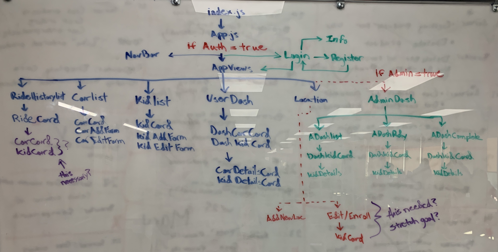
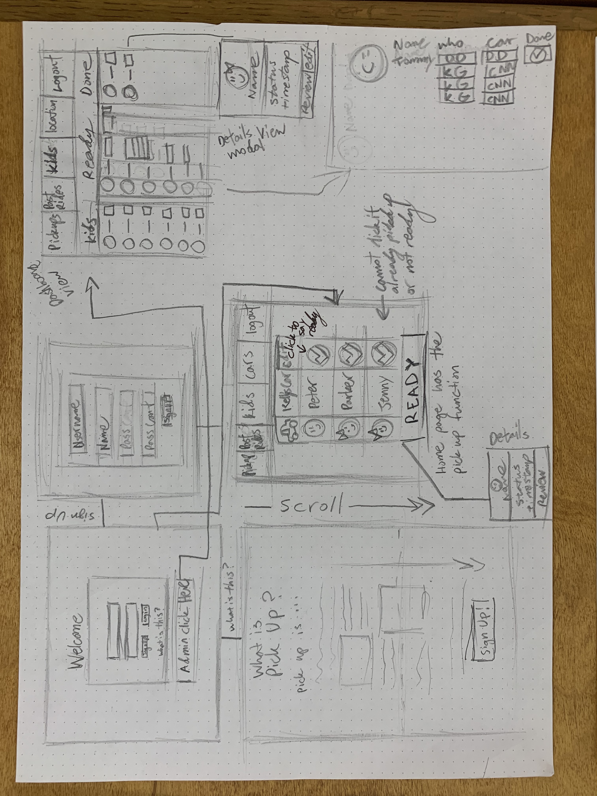
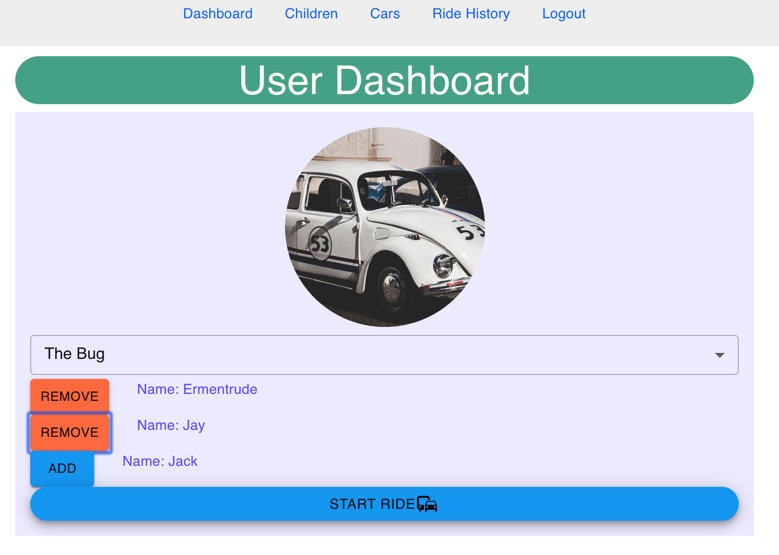

# RideAware: The Safest Way to Pick Up Your Child from School

RideAware facilitates parents/guardians picking up their children from school. The app allows parents to let teachers know when they are at the school and ready to pick them up, and the teachers are able to see who is picking them and what car to look out for and once picked up mark them as completed. The app will keep a record of whom was picked up and by which guardian and in what car. Users are able to upload name/picture/age of their kid for identification, and picture/nickname/make/model/color of car.

### Challenge Statement

How might we provide a safe and efficient communications tool for parental guardians and school staff to improve the after school child car-rider process?

## Persona

## ERD

## Content Map

## WireFrames

## Screenshots of Live App
### User DashBoard

### User Car Manager

### User RideHistory

### Admin DashBoard

## User Testing

For research I interviewed some parents that have children that attend Dan Mills Elementary and school faculty who have been involved in the after-school car-rider process.

## Lessons Learned

    Observing user testing throughout the creation of a project can help keep focus on areas that are important to the end user.
    Referring to the personas can help guide decision making.

## To Install

In the project directory, run: npm install

Followed by:

npm start Runs the app in the development mode.

To start the server run json-server-relationship -p 8088 -w database.json

Open http://localhost:3000 to view it in the browser.
